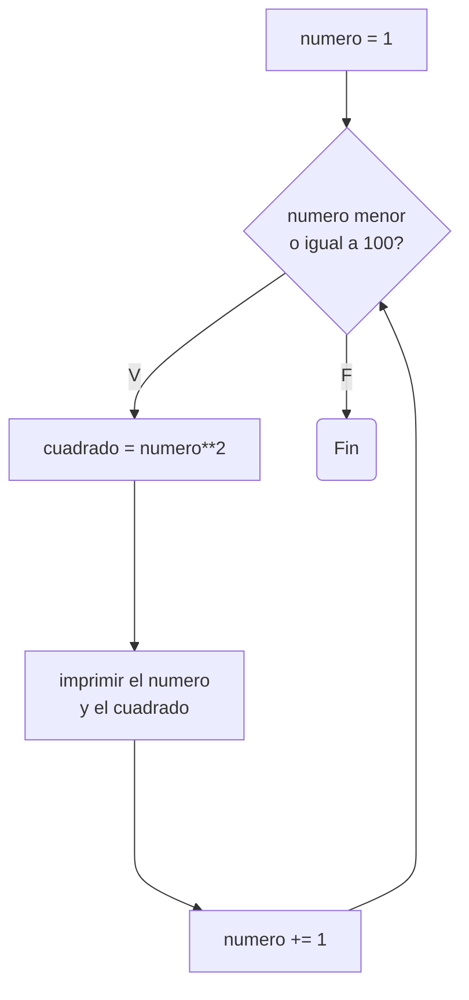
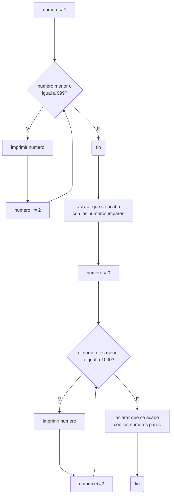
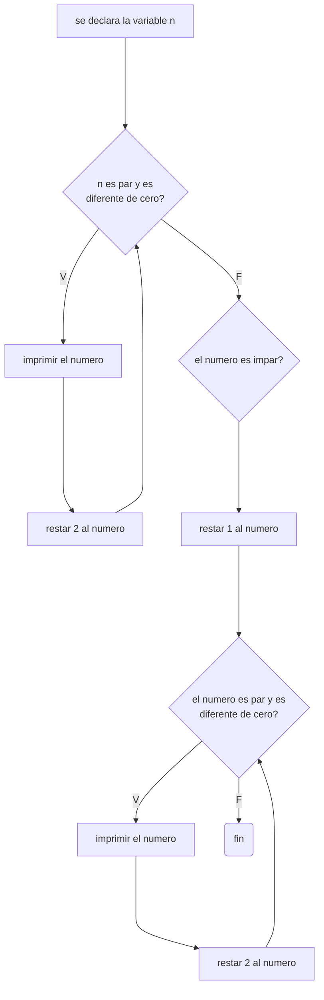

# Reto-No.7

## 1. Imprimir un listado con los números del 1 al 100 cada uno con su respectivo cuadrado.

```python
numero = 1 #se declara la variable

while numero<=100: #ciclo while hasta el numero 100
    cuadrado = numero**2
    print(f"El numero es {numero} y su cuadrado {cuadrado}")
    numero += 1 #se le suma 1 a la variable para que el ciclo no sea infinito
```

## Diagrama de flujo



## 2. Imprimir un listado con los números impares desde 1 hasta 999 y seguidamente otro listado con los números pares desde 2 hasta 1000.

```python
numero = 1 #se declara la variable impar

while numero<=999: 
    print(numero)
    numero += 2 #se le suma de 2 en 2 al impar inicial de forma que imprime solo los impares

print("Fin listado números impares") #aclaracion para separar los listados

numero = 0 #se re-declara la variable pero esta vez con un par

while numero<=1000:
    print(numero)
    numero += 2 #se le suma de 2 en 2 al par re-declarado de forma que imprime solo los pares

print("Fin listado números pares") #aclaracion para separar los listados
```

## Diagrama de flujo



## 3. Imprimir los números pares en forma descendente hasta 2 que son menores o iguales a un número natural n ≥ 2 dado

```python
n = int(input("Escriba el número: ")) #se le pide al usuario el numero

while n%2 == 0 and n!=0: #el ciclo para cuando n es par y hasta el 2
    print(n)
    n -= 2 #se va restando de 2 en 2

if n%2==1: #condicional por si el numero es impar
    n = n-1 #se convierte el numero en par 
    while n%2==0 and n!=0: #se reutiliza el ciclo
        print(n)
        n -=2
```

## Diagrama de flujo



## 4. En 2022 el país A tendrá una población de 25 millones de habitantes y el país B de 18.9 millones. Las tasas de crecimiento anual de la población serán de 2% y 3% respectivamente. Desarrollar un algoritmo para informar en que año la población del país B superará a la de A.

```python
```

## 5. Imprimir el factorial de un número natural n dado.

```python
```

## 6. Implementar un algoritmo que permita adivinar un número dado de 1 a 100, preguntando en cada caso si el número es mayor, menor o igual.

```python
```

## 7. Implementar un programa que ingrese un número de 2 a 50 y muestre sus divisores.

```python
```

## 8. Implementar el algoritmo que muestre los números primos del 1 al 100. Nota: use funciones

```python
```
