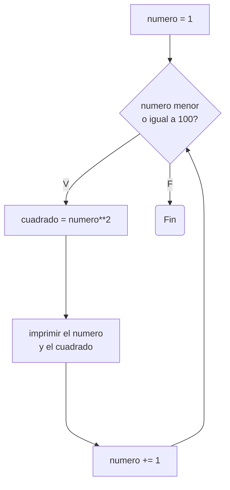
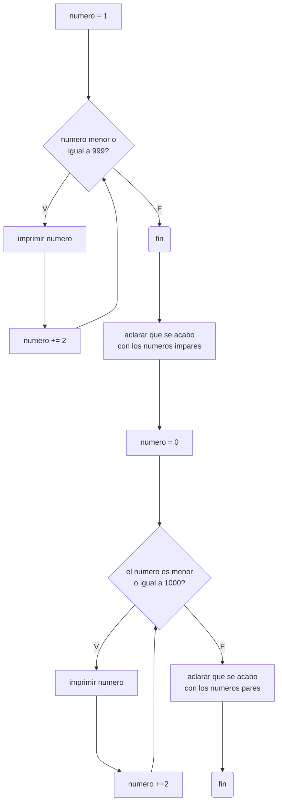
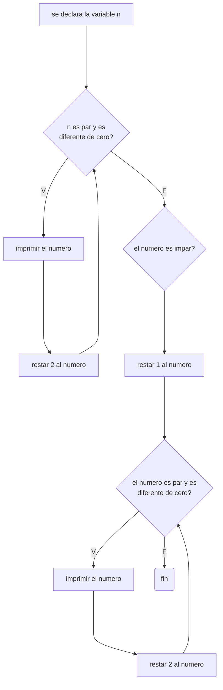

# Reto-No.7

## 1. Imprimir un listado con los números del 1 al 100 cada uno con su respectivo cuadrado.

```python
numero = 1 #se declara la variable

while numero<=100: #ciclo while hasta el numero 100
    cuadrado = numero**2
    print(f"El numero es {numero} y su cuadrado {cuadrado}")
    numero += 1 #se le suma 1 a la variable para que el ciclo no sea infinito
```

## Diagrama de flujo



## 2. Imprimir un listado con los números impares desde 1 hasta 999 y seguidamente otro listado con los números pares desde 2 hasta 1000.

```python
numero = 1 #se declara la variable impar

while numero<=999: 
    print(numero)
    numero += 2 #se le suma de 2 en 2 al impar inicial de forma que imprime solo los impares

print("Fin listado números impares") #aclaracion para separar los listados

numero = 0 #se re-declara la variable pero esta vez con un par

while numero<=1000:
    print(numero)
    numero += 2 #se le suma de 2 en 2 al par re-declarado de forma que imprime solo los pares

print("Fin listado números pares") #aclaracion para separar los listados
```

## Diagrama de flujo



## 3. Imprimir los números pares en forma descendente hasta 2 que son menores o iguales a un número natural n ≥ 2 dado

```python
n = int(input("Escriba el número: ")) #se le pide al usuario el numero

while n%2 == 0 and n!=0: #el ciclo para cuando n es par y hasta el 2
    print(n)
    n -= 2 #se va restando de 2 en 2

if n%2==1: #condicional por si el numero es impar
    n = n-1 #se convierte el numero en par 
    while n%2==0 and n!=0: #se reutiliza el ciclo
        print(n)
        n -=2
```

## Diagrama de flujo



## 4. En 2022 el país A tendrá una población de 25 millones de habitantes y el país B de 18.9 millones. Las tasas de crecimiento anual de la población serán de 2% y 3% respectivamente. Desarrollar un algoritmo para informar en que año la población del país B superará a la de A.

```python
#se declaran las 3 variables
pais_a = 25000000 
pais_b = 18900000
fecha = 2022

while pais_b<pais_a: #ciclo cuando la población del B es menor
    print(f"En el año {fecha} la poblacion del pais A es {pais_a}, la del pais B es {pais_b}") #se imprime el incremento cada año
    #se incrementa cada año la población con la tasa de crecimiento
    pais_a = pais_a + pais_a*(2/100) 
    pais_b = pais_b + pais_b*(3/100) 
    fecha += 1

#cuando el ciclo terminó significa que el B supero al de A y se imprime el mensaje
print(f"La poblacion del pais A de {pais_a} habitantes fue superada por el pais B con una poblacion de {pais_b} en el año {fecha}")
```

## 5. Imprimir el factorial de un número natural n dado.

```python
n = int(input("Escriba el numero al que le quiere sacar el factorial: ")) #se pide al usuario el numero

#se tiene en cuenta el caso en el que el numero sea 1
if n==1:
    print("El factorial de 1 es 1")

#se declara una variable la cual va a ser la multiplicación del numero con el numero anterior
p = n * (n-1)

while n>2: #ciclo mientras cuando el numero es mayor a 2
    n -= 1 #se disminuye en 1 el numero
    p = p * (n-1) #el p ya declarado se multiplica con el anterior del numero anterior, ya que en este punto se disminuyo n en 2 por la linea de arriba

#se pone el if por si el numero es 1 para que no imprima la linea
if n!=1:
    print(f"El factorial es {p}")
```

## 6. Implementar un algoritmo que permita adivinar un número dado de 1 a 100, preguntando en cada caso si el número es mayor, menor o igual.

```python
def adivinador(): #se crea la funcion para adivinar
    print("Escoja un número del 1 al 100") #se le dice al usuario que piense en un numero

    numero_adivinado = 50 #se define una variable igual a 50
    
    while True: #bucle que siempre se va a ejecutar excepto cuando la respuesta sea "igual"
        respuesta = input(f"{numero_adivinado} es mayor, menor o igual al numero?: ")
        respuesta = respuesta.lower()
        
        if respuesta == "igual": #aqui el bucle se termina
            print(f"El numero es {numero_adivinado}")
            break
        elif respuesta == "menor": 
            numero_adivinado -= 1 #se le resta 1 a la variable y el bucle sigue
        else:    
            numero_adivinado += 1 #se le suma 1 a la variable y el bucle sigue

adivinador() #se llama a la funcion
```

## 7. Implementar un programa que ingrese un número de 2 a 50 y muestre sus divisores.

```python
numero = int(input("Ingrese un numero del 2 al 50: ")) #se pide el numero

divisor = 1 #se crea una variable igual a 1

print(f"Los divisores de {numero} son:") #print para aclarar el inicio de la lista de los divisores

while divisor<=numero: 
    if numero%divisor == 0: #si el residuo es 0 significa que es divisor
        print(divisor)

    divisor += 1 #incremento para cada iteracion

print(f"Fin lista de los divisores de {numero}") #print para aclarar el fin de la lista de los divisores
```

## 8. Implementar el algoritmo que muestre los números primos del 1 al 100. Nota: use funciones

```python
def primo(numero): #funcion para saber si el numero es primo o no
    numero_divisor = 1 #se define una variable = 1 que es el divisor
    indicador = 0 #se define una variable por si el numero tiene mas de 2 divisores, que al inicio es 0
    while numero_divisor<=100: 
        if numero%numero_divisor == 0: #si es cierto significa que numero_divisor es divisor de numero
            indicador += 1 #el numero de veces que aumente significa el numero de divisores que tiene el numero
            if indicador > 2: #si es cierto significa que el numero no es primo ya que tiene mas de 2 divisores, entonces retorna un False
                return False
        numero_divisor += 1 #se incrementa el divisor en 1 y se vuelve a el ciclo
    return True #si se salio del bucle significa que no retorno un Falso nunca, osea no tiene mas de 2 divisores por lo que es primo y se retorna un True

if __name__ == "__main__": #funcion main
    numero = 2 #variable = 2 ya que 1 no es primo
    while numero<=100: 
        if primo(numero) == True: #si el numero es primo
            print(f"{numero} es primo")
        numero +=1 #incremento cada ciclo
```
